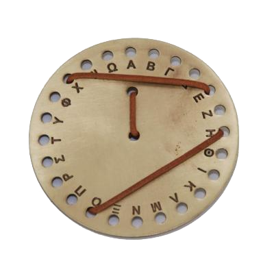
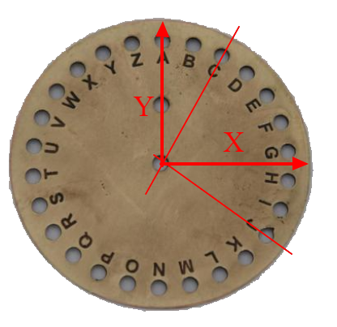

# Aeneas' cryptographic disc (4th c. B.C.)

Aeneas' cryptographic disc was a bronze disc with 24 holes (one for each letter of the Greek alphabet) on the periphery and one in the center. The sender formed the message by passing a thin thread through the holes of the relevant letters and the receiver read it by removing the thread and noting the letters from right to left.

Given the specifications of a disc created for the Latin alphabet, you are requested to calculate the length of the thread.


### Assumptions

* All letters have the same and exact distance from the center of the disc, as given in the input.
* The thread is so small, that its width doesn't change the result.
* Each letter hole is ideal and so small that while the thread can pass successfully only at the center of the hole, it doesn't change the result, even if it passes numerous times.
* The disc is so thin, that every time the thread turns in a letter hole from front to the back of the disc and vice versa, it doesn't affect the overall result.
* The thread always starts from the center of the disc and goes towards the first letter, then the second one, etc.
* In case, we have multiple consecutive equal letters then only the first one is used.

### Standard input

The first line contains a single integer, the distance between the center of the disc and each letter (all letters have the same distance from the center), within the range [1,100] cm.

Each of the next 26 lines has one capital English letter (not necessarily in alphabetical order) followed by a decimal number, the angle in degrees of the letter from the x-axis, counterclockwise within the range [0.0,360.0). For example, in the image above, you can see letter A is on 90 degrees and C is on about 60 degrees.


### Standard output

You should print a single integer, which is the length in cm of the thread needed to express the message given in the input as stated above as a decimal, rounded up to the next integer number. Thread starts from point (0,0) and ends at the final given letter.

### Constraints and notes

* High precision variables might be needed for you floating point operations (e.g. in C/C++ using double is preferred)
* Time limit: 3000 ms
* Memory limit: 64 MB

### Input & Output

input:

```
52
A 168.05
B 41.27
C 119.19
D 312.43
E 236.94
F 269.85
G 318.46
H 206.02
I 140.19
J 162.81
K 199.80
L 207.06
M 217.69
N 220.22
O 282.10
P 80.42
Q 312.29
R 324.76
S 348.38
T 311.84
U 289.66
V 137.41
W 175.23
X 0.47
Y 198.07
Z 251.39
IEEEXtreme rocks!
```

output:

```
763
```