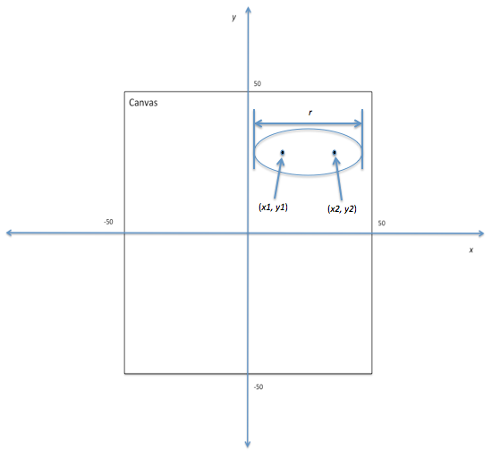

# Xtreme 10.0 - Ellipse Art

In IEEEXtreme 9.0, you met the famous artist, I.M. Blockhead. This year we want to introduce you to another famous artist, Ivy Lipps. Unlike I.M., Ivy makes her art by painting one or more ellipses on a canvas. All of her canvases measure 100 by 100 cms.

She needs your help. When she is done with the painting, she would like to know how much of the canvas is unpainted.

### Input Format

The first line of input contains t, 1 ≤ t ≤ 8, which gives the number of test cases.

Each test case begins with a single integer, n, 1 ≤ n ≤ 40, which indicates the number of ellipses that Ivy has drawn.

The following n lines give the dimensions of each ellipse, in the following format:

```
x1 y1 x2 y2 r
```

Where:

* (x1, y1) and (x2, y2) are positive integers representing the location of the foci of the ellipse in cms, considering the center of the canvas to be the origin, as in the image below.
* r is a positive integer giving the length of the ellipse's major axis

You can refer to the <a href="https://en.wikipedia.org/wiki/Ellipse">Wikipedia webpage for background information on ellipses</a>.



Coordinate system for the canvas.

### Constraints

-100 ≤ x1, y1, x2, y2 ≤ 100

r ≤ 200

r ≥ sqrt(((x2 - x1)^2 + (y2 - y1)^2)) + 1

Note that these constraints imply that a given ellipse does not need to fall completely on the canvas (or even on the canvas at all).

### Output Format

For each test case, output to the nearest percent, the percent of the canvas that is unpainted.

Note: The output should be rounded to the nearest whole number. If the percent of the canvas that is unpainted is not a whole number, you are guaranteed that the percent will be at least 10% closer to the nearer percent than it is from the second closest whole percent. Therefore you will not need to decide whether a number like 23.5% should be rounded up or rounded down.

### Sample Input

```
3
1
-40 0 40 0 100
1
10 50 90 50 100
2
15 -20 15 20 50
-10 10 30 30 100
```

### Sample Output

```
53%
88%
41%
```

### Explanation

The ellipse in the first test case falls completely within the canvas, and it has an area of approximately 4,712 cm2. Since the canvas is 10,000 cm2, 53% of the canvas is unpainted.

In the second test case, the ellipse has the same size as in the first, but only one quarter of the ellipse is on canvas. Therefore, 88% of the canvas is unpainted.

In the final testcase, the ellipses overlap, and 41% of the canvas is unpainted.

### Analysis

Using Monte Carlo Simulation, calculate the ratio of the points in ellipse and the total points to estimate real area. Note that the gap between points affects the precision.