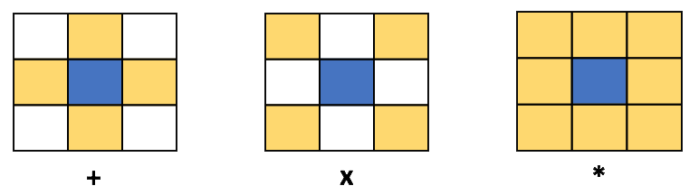

# Fill The Pixels

You were going through a bunch of black and white pictures and all of a sudden, a quirky idea struck to your mind – how many clicks does it take to convert all the white pixels into black and clear out a picture using brushes? So, you scanned and converted several pictures into binary data. Each pixel of the binary pictures are now represented by an integer, 0 for a black pixel and 1 for a white pixel.

To modify a picture, you can only use one of the three brushes each time:

* <code>+</code>(plus) - When used, the pixels at the left, top, right and bottom of the current pixel are also colored in the same color.
* <code>x</code>(cross) - When used, the pixels at the top-left, top-right, bottom-right and bottom-left of the current pixel are also colored in the same color.
* <code>*</code>(star) - When used, all 9 pixels around the current pixel are also colored in the same color.

Each of these brushes, when used, works recursively. So if you color a pixel, its neighbours will get colored, then the neighbours of the neighbours, and so on.


Your task is to compute the minimum clicks you will have to perform with each brush in order to clear out a picture.

So you will have to compute the minimum clicks that are needed to clear the picture using only the <code>+</code> brush, then compute the minimum clicks that are needed to clear the picture using only the <code>x</code> brush and finally compute the minimum clicks that are needed to clear the picture using only the <code>*</code> brush.

### Standard input

Input begins with a single number t(1≤t≤100), which denotes the number of pictures to process.

Each test case begins with a line, which contains 2 space-separated integers w and h denoting the width and the height of the picture in pixels.

Following there will be h lines denoting the w pixel values (either 0 or 1) of each row of the picture.

### Standard output

For each test case output, 3 space separated integers which denote the minimum number of clicks needed to clear out the picture for each of the three brushes: <code>+</code>, <code>x</code> and <code>*</code>.

### Constraints and notes

* 1≤t≤100 
* 1≤w,h≤1000
* Time limit: 1000 ms
* Memory limit: 256 MB

### Input & Output

input:

```
2
7 4
1011001
0010001
0001000
0000001
26 13
11111111111111111111111111
11111100111111111100111111
11110001111100111110001111
11000001111000011110000011
10000000111000011100000001
10000000000000000000000001
00000000000000000000000000
00000000000000000000000000
10000000000000000000000001
10000110001000010001100001
11001111111100111111110011
11100111111100111111100111
11111111111111111111111111
```

output:

```
5 6 4
2 18 2
```