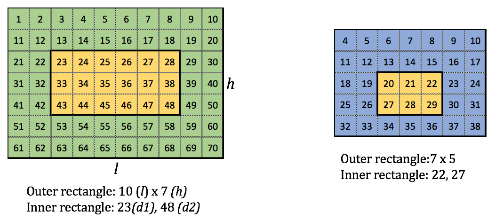

# RecXor

A rectangle of dimensions l×h(1≤l,h≤10^6) is filled with numbers sequentially starting from number n(1≤n≤10^9) till the end of the rectangle. There is a second rectangle that fits inside the first rectangle and is defined by the end points of either of the diagonals, say d1 and d2 (n≤d1≤d2<n+l*h) which denote the numbers the diagonal starts from and ends at respectively. Your task is to find the xor of all the numbers that are not common to both of the rectangles. (Images below for better understanding.)



### Standard input

Input begins with a single number t(1≤t≤100), which denotes the number of test cases.

Each test case begins with a line, which contains 5 space-separated integers l,h,n,d1,d2.

### Standard output

For each test case output a single number which is the xor of all the number that are not common to the rectangles.

### Constraints and notes

* 1≤t≤100 
* 1≤l,h≤10^6
* 1≤n≤10^9
* d1≤d2
* The sum of l for all the tests in a file is ≤10^6.
* The sum of h for all the tests in a file is ≤10^6.
* Time limit: 500 ms
* Memory limit: 256 MB

### Input & Output

input:

```
2
10 7 1 23 48
7 5 4 22 27
```

output:

```
80
42
```

### Explanation

The test cases are for the images above. The xor of the uncommon numbers are 80 and 42 respectively.