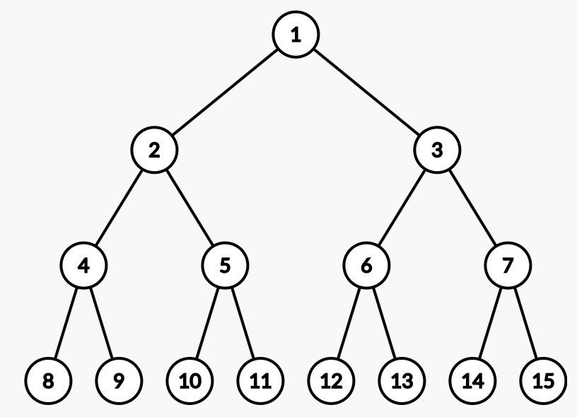

# Rumour

Consider a full binary tree with an infinite number of levels. The vertices are labeled with positive integers, starting from the root and moving down the tree, from left to right on each level. In the example below you can see the first 4 levels of the tree:


Answer q(1≤q≤10^6) queries of the form: find the minimum distance between vertices a and b(1≤a,b≤10^18).

### Standard input

The first line contains integer q.

The next q lines contain two integers, a and b.

### Standard output

Print q lines, on line i the answer for the i-th query.

### Constraints and notes

* 1≤q≤10^6
* 1≤a,b≤10^18
* Time limit: 2500 ms
* Memory limit: 256 MB

### Input & Output

input:

```
4
1 1
1 2
2 3
10 6
```

output:

```
0
1
2
5
```