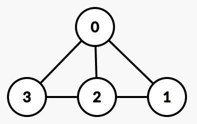
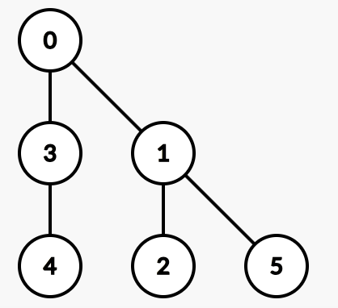

# Vangelis the Batbear and the Bubbles challenge

<center>Time limit: 1000 ms</center>
<center>Memory limit: 256 MB</center>

Good evening master Wayne.

Joker and his gang attended Black Hat USA 2017 where they learned of a new way on how to damage our city! Specifically, tomorrow night they will try to damage the water pumps of Gotham using bubbles!

The bubbles cause corrosion to the pumps and in a few hours they will damage them with catastrophic results! To dash Joker’s plan, besides stopping him, you need to make sure that the city network does not contain loops.

If Joker manages to inject bubbles to the network and they enter a loop, they will still cause damage to that area even though you would have already arrested Joker and his gang.

Given the map of the water distribution system, you need to make sure that the map does not contain loops.

### Standard input

On the first line there will be an integer <code>t</code>, the number of test cases to follow.

For each test case, there will be 2 input lines:

* On the first line of the test case, there will be 2 integers <code>n</code> and <code>m</code>, where <code>n</code> is the number of vertices and <code>m</code> is the number of edges.
* On the second line, there will be <code>m</code> pairs of integers separated by a space character. Each pair shows a two way connection between vertex <code>a</code> and vertex <code>b</code>.

### Standard output

For each test case you will have to write one line that contains an integer, in the case where there is a loop you will write the number 1 or else you will write the number 0.

### Constraints and notes

* 1≤t≤1000
* 1≤n≤1000 
* 1≤m≤10000 
* 0≤a,b≤n−1 
* There can be multiple edges or self-loops. In this case we consider the graph to contain a loop.

### Input

```
2
4 5
0 1 0 2 1 2 2 3 0 3
6 5
0 1 0 3 1 2 1 5 3 4
```

### Output

```
1
0
```

### Explanation

Test case #1

<center></center>

Test case #2

<center></center>